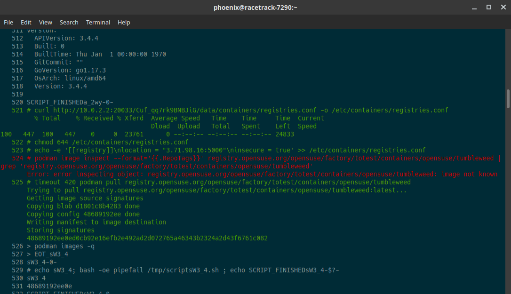

# openqa-serial

Improved openQA serial reader.

This is a small CLI tool to improve the readability of the `serial_terminal.txt` file when debugging openQA jobs. It tries to parse the serial output of a given openQA job and formats for better readability. When possible it removes openQA tokens to reduce the amount of unnecessary and distractive output.

## Usage

Synopsis

    openqa-serial [OPTIONS] INPUT
    
    OPTIONS
      -n, --no-numbers                                Don't display command numbers

The tool accepts openQA job URLs or filenames as `INPUT`. You don't have to point to the `serial_terminal.txt` file directly, the tool auto-completes this itself, unless another file is specifically given.

Example

    openqa-serial https://duck-norris.qe.suse.de/tests/11617

## Build

This is a plain `go` application without external dependencies. Simply do a `make` or `go build ./...` to compile the binary. 

    make                       # build binary

For your own convenience, place the resulting `openqa-serial` binary in your `~/bin/` folder to have access to it from everywhere.